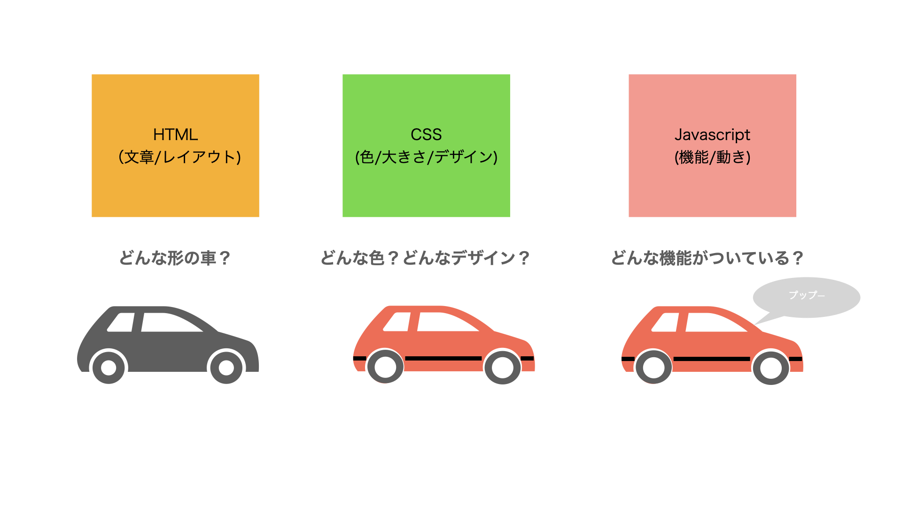

# [Javascript講座 基礎編](basic.html)

  <a class="box_right" href="basic2.html">
    <button class="btn bg-info">次の講義へ</button>
  </a>

## 第1章: Javascriptとは

### Javascriptとは？
プログラミング言語の１つです。

主にWebサイトなどを表示する際、ブラウザ上で動くことが得意なプログラミング言語です。

近年では、iOS/Androidのアプリの画面やサーバー側のプログラムにも使われたりしている汎用性の高い言語です。

### HTML/CSSとJavascriptの関係

 

Javascriptは、例えば、ボタンを押したときに動作をしたり、タイマーなどの機能を持たせたり、さまざまな機能をつけることができる便利な言語です。

 

### JavaとJavascriptの違い
結論を言うと、全然違います。

- 「メロンとメロンパン」くらい違います。
- 「コアラとコアラのマーチ」くらい違います。

Java言語は、Sun Microsystems社（Oracleが買収）が開発した言語で、コンパイルをしたらどんな環境でも動くと言うのが売りでとても人気の高い言語。

Javascirptは、Netscape Communications社が開発した言語で、手軽にコーディングできるスクリプト言語として開発されました。

#### なぜ、名前が似ているの？
元々は、LiveScriptと言う名前であったが、当時人気だったJavaにあやかりJavascriptと言う名前に変更した。

  <a class="box_right" href="basic2.html">
    <button class="btn bg-info">次の講義へ</button>
  </a>

