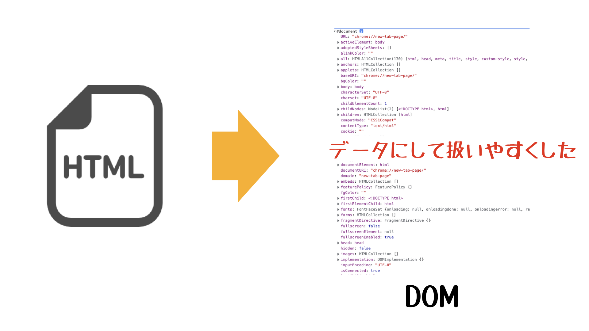
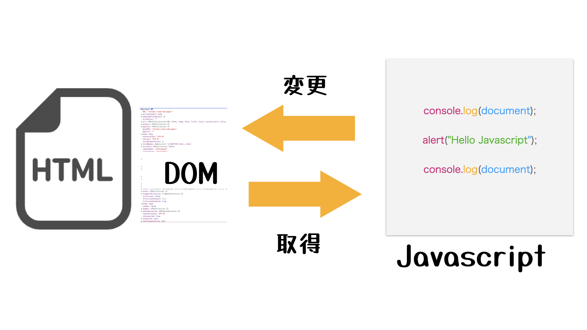
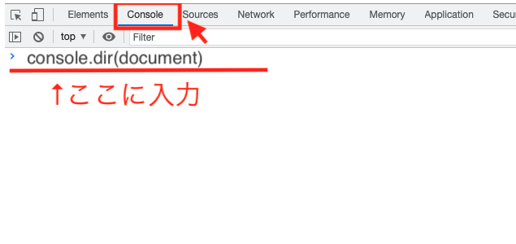

<style>
.mb {
  margin-bottom: 90px;
}
.mt {
  margin-top: 90px;
}
.box {
  position: relative;
}
.box .box_left {
  position: absolute;
  left: 0;
}
.box .box_right {
  position: absolute;
  right: 0;
}
.btn {
  padding: 6px 12px;
  border-radius: 7em;
  border: solid 1px #ccc;
}
.bg-info {
  background-color: #00a651;
  color: #ffffff;
}
footer {
    text-align: center;
    margin-top: 120px;
    padding: 30px;
}
</style>

# Javascript講座 DOM編

<div class="box mb">
  <a class="box_left" href="basic7.html">
    <button class="btn bg-info">前の講義へ</button>
  </a>
  <a class="box_right" href="dom2.html">
    <button class="btn bg-info">次の講義へ</button>
  </a>
</div>

## 第1章: DOMとは？

## 解説動画
<iframe width="560" height="315" src="https://www.youtube.com/embed/aMaYWgOgXGE" title="YouTube video player" frameborder="0" allow="accelerometer; autoplay; clipboard-write; encrypted-media; gyroscope; picture-in-picture" allowfullscreen></iframe>

## DOMとは？
**Document Object Model**の略です。

「**ドキュメント(Document)**」とは、HTMLやXMLファイルのことです。<br/>
「**オブジェクトモデル(Object Model)**」とは、このデータを1つの塊（モノ）として扱うようにするということです。<br/>



つまり、**HTMLのファイルを私たちがプログラミングで扱えるように、HTMLをデータのモデルとした**ということです。

<br/>



このDOMを扱うということは、**Javascriptのコードを書いて、HTMLから情報を取得したり、操作することができる**ということです。

<br/>
<br/>


ドキュメントについては、ブラウザで以下のコードを実行することで、DOMを見ることができます。

```
console.dir(document)
```

上記のコードで表示されたデータの塊がDOMです。

<br/>

一緒に実行してみましょう。

「右クリック」 -> 「検証」 -> 「Console」タブ 

画面の入力箇所に以下のコードを入力してEnterを押しましょう。

```
console.dir(document)
```




**DOM**は、いくつかの**要素が階層上**に入り組んで構成されています。

JavascriptのコードでこのDOMの情報を変更することで、Webブラウザで表示する内容を変更することができます。


<div class="box mt mb">
  <a class="box_left" href="basic7.html">
    <button class="btn bg-info">前の講義へ</button>
  </a>
  <a class="box_right" href="dom2.html">
    <button class="btn bg-info">次の講義へ</button>
  </a>
</div>

<footer>
    <small>© 2021 k-sasaking.net</small>
</footer>

